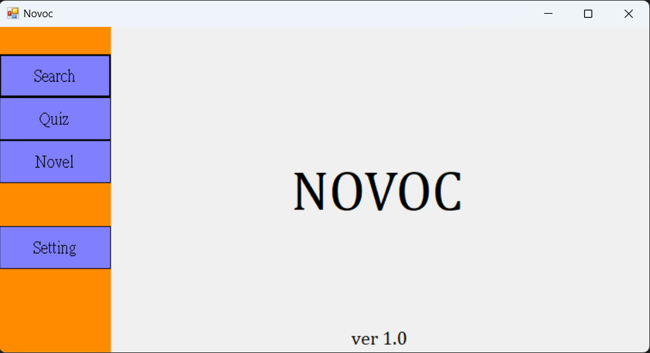
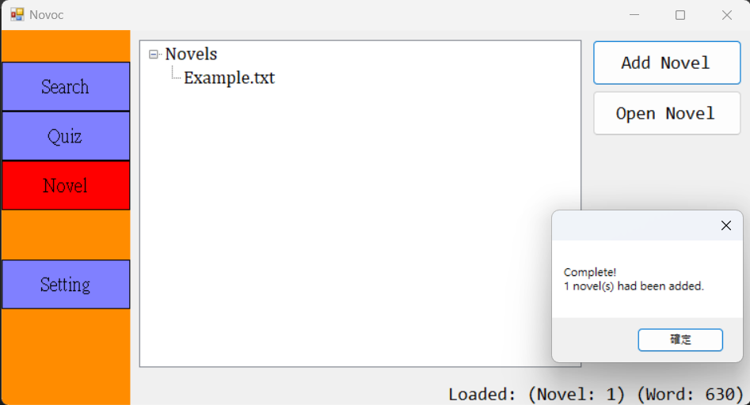
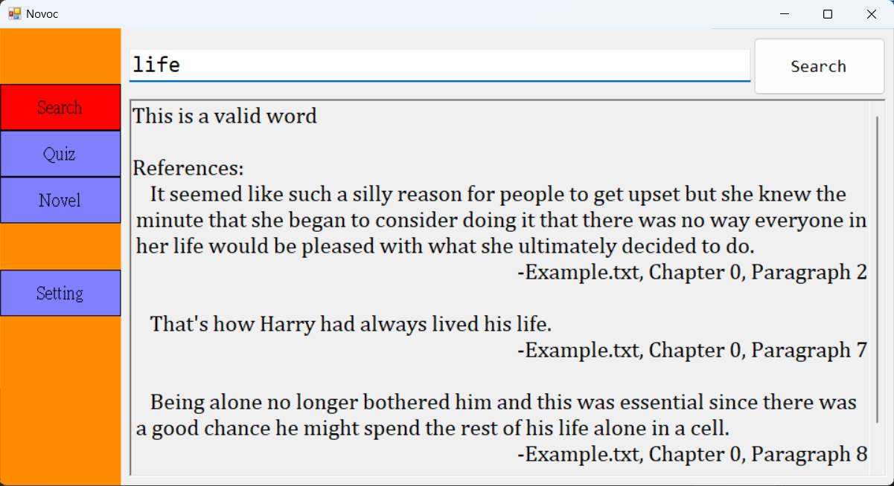

# Novoc
## A program aims to support learning English through massive novel reading

Novoc is a blend word of "Novel" and "Vocabulary". The program will first be loaded with massive amounts of text. The user can later query a given vocabulary in a reasonably short time.

## Features

Novoc currently supports reading the following file types:
* TXT Files (*.txt)
* Epub Files (*.epub)

After importing the text files, two actions could be done on their respective pages:
1. Query sentences around a vocabulary
2. Generate cloze quizzes given a word difficulty

The user could also choose to select only the sentence containing the words, or the whole paragraph.

## User Interface

### Main Page

### Novel Page

### Query Page

## Developer Notes
This is my final project as a computer science class student. The code would not be that clean, as I'm still learning how to write clean code.\
The machine folder showcases the practice of dependency injections. The view folder contains all of the sub-window forms of the project. The DataTypes file contains all of the major data types in the project.
